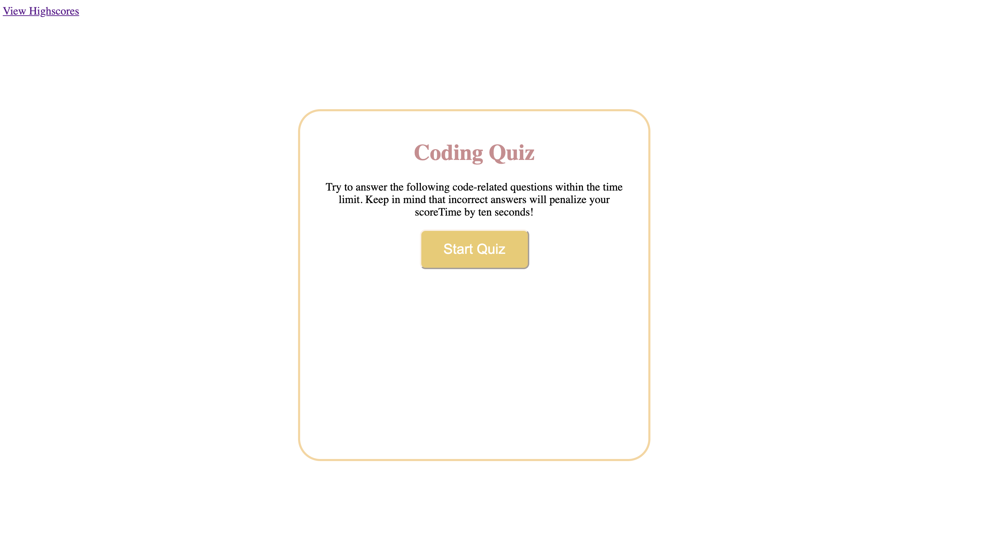
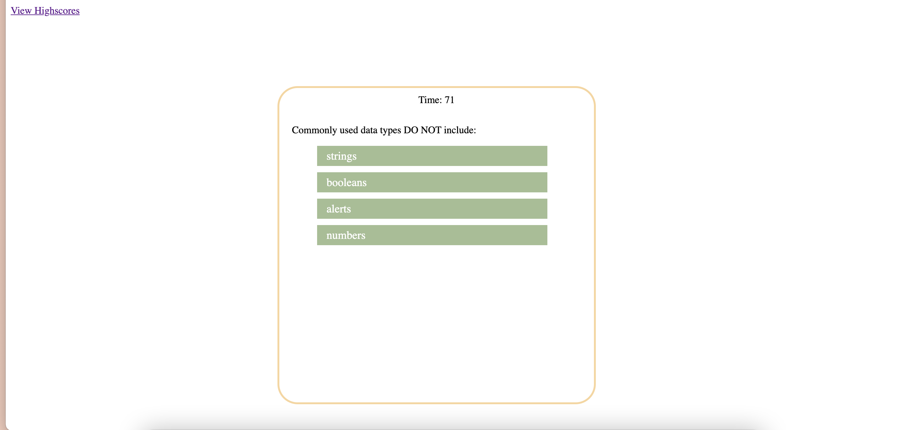

# Code-quiz-1
Happy quiz!
This week’s assignment invites the users to build a timed coding quiz with multiple-choice questions. This app will run in the browser and will feature dynamically updated HTML and CSS powered by JavaScript code that users write. It will have a clean, polished, and responsive user interface.

## Usage

* Demo of application

  
  

* Websites
  * [Github](https://github.com/wl0194)

## Features

* JavaScript
* CSS
* HTML

## License

Copyright (c) Amy Hwang. All rights reserved.

